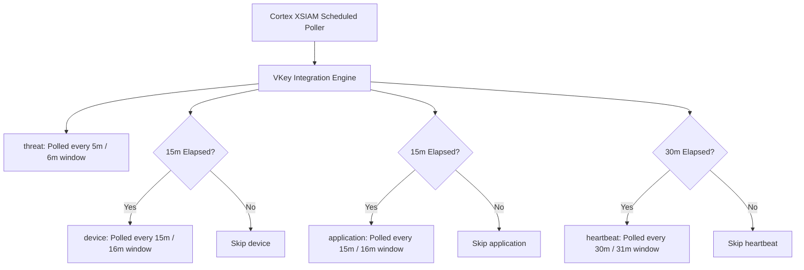

# V-Key V-OS Threat Intelligence Cortex XSIAM Content Pack — Project Overview

## 1. Project Summary
This repository contains the official Cortex XSIAM / XSOAR Content Pack for **V-Key V-OS Mobile Application Protection & Threat Intelligence**.

It collects and normalizes:
- **`threat`**: Runtime mobile application violations (Root/Jailbreak, Frida/Xposed hooks, Debuggers, Tampering, Malware).
- **`device`**: Device hardware profiles (Model, Manufacturer, OS Version, Architecture, DD Hash).
- **`application`**: App package metadata (Bundle ID, App Version, V-Guard Version, V-OS Processor Version).
- **`heartbeat`**: Background liveness and keepalive telemetry.

---

## 2. Directory Structure

```text
v-key-community-pack/
├── deploy.sh                     # Automated CLI for validation, packaging, and tenant deployment
├── check_connection.py           # Local standalone testing & JSON export script
├── install_demisto.md            # Demisto SDK installation & setup guide
├── contributing_content.md       # Cortex XSIAM contribution links & conventions
├── VS-OS Threat Intelligence SIEM API Guide.md # Formatted official API guide
├── CommonServerPython.py         # Demisto runtime stubs for IDE intellisense & testing
├── CommonServerUserPython.py
├── DemistoClassApiModule.py
├── demistomock.py
├── .env.example                  # Environment configuration template
├── .gitignore
├── README.md
├── PROJECT_OVERVIEW.md
└── Packs/
    ├── uploadable_packs/
    │   └── VKey.zip              # Standalone compiled pack archive
    └── VKey/
        ├── pack_metadata.json    # Marketplace metadata (Author, tags, categories)
        ├── CONTRIBUTORS.json     # Pack contributors
        ├── Author_image.png      # Author avatar
        ├── VKey_image.png        # Pack icon
        ├── README.md             # Pack documentation
        ├── .pack-ignore
        ├── .secrets-ignore
        ├── ReleaseNotes/
        │   └── 1_0_0.md          # Version changelog
        └── Integrations/
            └── VKey/
                ├── VKey.py       # Integration source code (BaseClient)
                ├── VKey.yml      # Integration YAML specification
                ├── VKey_test.py  # Pytest unit tests
                ├── VKey_description.md
                ├── VKey_image.png
                └── README.md     # Integration parameter & command guide
```

---

## 3. Demisto SDK Commands & Validation

### Run Validation
```bash
./deploy.sh validate
# or
demisto-sdk validate -i Packs/VKey
```

### Run Unit Tests
```bash
./venv-demisto/bin/pytest Packs/VKey/Integrations/VKey/VKey_test.py
```

### Compile Standalone Zip
```bash
./deploy.sh zip
```

### Deploy to Cortex XSIAM Tenant
```bash
# Deploy to Development
./deploy.sh dev

# Deploy to Production
./deploy.sh prod
```

---

## 4. Architecture & Polling Strategy (Option 1)


