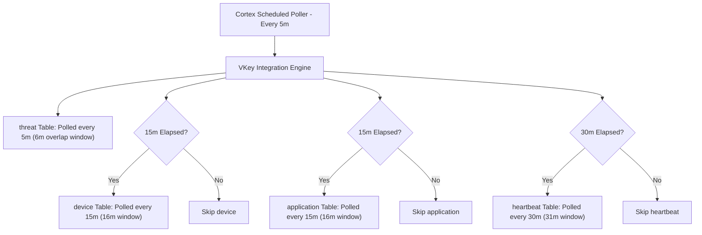

# Cortex XSIAM Content Pack: V-Key V-OS Threat Intelligence

[](#)
[](#)
[](#)
[](#)

Community-developed **Cortex XSIAM Content Pack** for integrating **V-Key V-OS Mobile Application Protection & Business Security Intelligence (BSI)**.

---

## 📌 Project Overview

This content pack enables continuous ingestion, normalization, and SOC analysis of mobile application security violations and device telemetry from V-Key's Azure APIM Gateway into **Cortex XSIAM**.

### Telemetry Datasets Collected
- **`threat`**: Runtime mobile attacks (Root/Jailbreak, Frida/Xposed hooking, Debuggers, Tampering, Malware).
- **`device`**: Device hardware & environment inventory (Model, Manufacturer, OS Version, Architecture, DD Hash).
- **`application`**: App package & SDK integrity (Bundle ID, App Version, V-Guard Version, V-OS Processor Version).
- **`heartbeat`**: Background liveness and keepalive telemetry.

---

## 📂 Repository Structure

```text
v-key-community-pack/
├── deploy.sh                     # Automated CLI for validation, packaging, and tenant deployment
├── install_demisto.md            # Demisto SDK installation & setup guide
├── contributing_content.md       # Cortex XSIAM contribution links & conventions
├── CommonServerPython.py         # Demisto runtime stubs for IDE intellisense & pytest
├── CommonServerUserPython.py
├── DemistoClassApiModule.py
├── demistomock.py
├── .env.example                  # Environment configuration template
├── .gitignore
├── README.md                     # Main repository documentation
├── Documentation/                # Official and reference documentation
│   └── VS-OS Threat Intelligence SIEM API Guide.md
├── tools/                        # Local developer utilities
│   ├── check_connection.py       # Standalone local fetcher & JSON exporter
│   └── vkey_data_output/         # Local test output JSON files
└── Packs/
    ├── uploadable_packs/
    │   └── VKey.zip              # Standalone compiled pack archive
    └── VKey/
        ├── pack_metadata.json    # Marketplace metadata (Author, tags, categories)
        ├── CONTRIBUTORS.json     # Pack contributors
        ├── Author_image.png      # Author avatar
        ├── VKey_image.png        # Pack icon
        ├── README.md             # Pack documentation
        ├── .pack-ignore
        ├── .secrets-ignore
        ├── ReleaseNotes/
        │   └── 1_0_0.md          # Version changelog
        └── Integrations/
            └── VKey/
                ├── VKey.py       # Integration source code (BaseClient)
                ├── VKey.yml      # Integration YAML specification
                ├── VKey_test.py  # Pytest unit tests (100% passing)
                ├── VKey_description.md
                ├── VKey_image.png
                └── README.md     # Integration parameter & command guide
```

---

## ⚡ Architecture & Polling Strategy

The integration uses **Option 1: Smart Sub-Schedules**, running within a single scheduled execution while respecting V-Key's recommended polling intervals per table:



---

## 🚀 Quick Start & CLI Automation

The included `deploy.sh` script automates validation, testing, packaging, and tenant deployment:

### 1. Run Demisto SDK Validation
```bash
./deploy.sh validate
```

### 2. Run Pytest Unit Tests
```bash
./venv-demisto/bin/pytest Packs/VKey/Integrations/VKey/VKey_test.py
```

### 3. Build Standalone Zip Package
```bash
./deploy.sh zip
```
The compiled archive is generated at `Packs/uploadable_packs/VKey.zip`.

### 4. Deploy Directly to Cortex XSIAM
```bash
# Deploy to Development Tenant (.env.dev or .env)
./deploy.sh dev

# Deploy to Production Tenant (.env.prod)
./deploy.sh prod
```

---

## 🛠️ Local Testing with `tools/check_connection.py`

You can test API queries and export combined JSON datasets locally without deploying to Cortex:

```bash
# Query last 1 hour
python3 tools/check_connection.py --window 60

# Query last 7 days (10080 minutes)
python3 tools/check_connection.py --window 10080
```

---

## 👨‍💻 Author & Support
- **Author**: Prima Secondary Ramadhan
- **GitHub**: [@primasr](https://github.com/primasr)
- **Support**: Community Support
